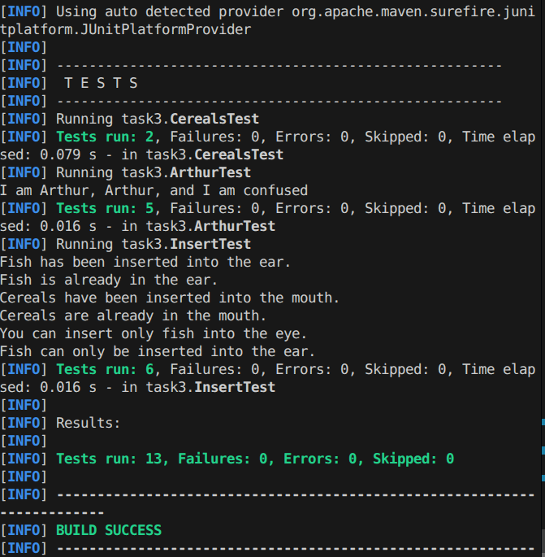

# TPO_1_lab

## Задание 3
-----

### Предметная область

```
У Форда в руке был стеклянный флакончик, в котором плавала, переливаясь, маленькая желтая рыбка. Артур смотрел на него, моргая глазами. Ему хотелось, чтобы здесь было что-нибудь простое и знакомое, за что можно было бы мысленно зацепиться. Он чувствовал бы себя увереннее, если бы рядом с нижним бельем дентрасси, скворншельскими матрацами и человеком с Бетельгейзе, держащим маленькую рыбку и предлагающим засунуть ее в ухо, он увидел, к примеру, пакет кукурузных хлопьев.
```

### Выделенные сущности и объекты

**Сущности:**
- Форд (Ford) — персонаж, держащий рыбку.
- Артур (Arthur) — персонаж, который хочет увидеть хлопья.

**Объекты-значения:**
- Флакончик (Bottle) — не реализован отдельно, но упоминается.
- Рыбка (Fish) — объект, который можно вставить в ухо.
- Хлопья (Cereals) — объект, который можно вставить в рот.

**Бизнес-правила:**
1. Рыбка должна быть помещена только в ухо.
2. Хлопья могут быть помещены только в рот (Room в контексте сцены).
3. Состояние персонажей меняется после успешного помещения объекта:
   - Форд становится «Satisfied», когда рыбка в ухе.
   - Артур становится «Sure», когда хлопья в комнате (роту).

### Классы и их ответственность

Проект реализован на Java с использованием JUnit 5 для тестирования.

#### Основные классы

1. **`Person` (абстрактный класс)**
   - Атрибуты: `name` (имя), `condition` (состояние).
   - Методы: геттеры/сеттеры для атрибутов.
   - Наследуется классами `Arthur` и `Ford`.

2. **`Arthur` (наследник `Person`)**
   - Переопределяет метод `say()`, который выводит в консоль фразу «I am Arthur, …».
   - Используется для представления персонажа Артура.

3. **`Ford` (наследник `Person`)**
   - Аналогично `Arthur`, но с именем Ford.

4. **`Fish`**
   - Атрибут `place` (тип `Places`).
   - Метод `insert(Places place)` изменяет местонахождение рыбки.

5. **`Cereals`**
   - Атрибуты: `typeCerals` (тип хлопьев), `place` (место).
   - Конструктор принимает тип хлопьев.

6. **`Places` (перечисление)**
   - Возможные места: `EAR`, `EYE`, `NOSE`, `MOUTH`, `Bottel`, `Room`.

7. **`Insert` (класс бизнес-логики)**
   - Содержит методы для вставки объектов:
     - `insertFish(Fish fish, Places place, Ford ford)` — вставляет рыбку в указанное место, проверяет правила.
     - `insertCereals(Cereals cereals, Places place, Arthur arthur)` — вставляет хлопья в указанное место, проверяет правила.

### UML диаграмма классов

```
mermaid
classDiagram
    class Person {
        -String name
        -String condition
        +Person(String name, String condition)
        +setName(String name)
        +setCondition(String condition)
        +getName() String
        +getCondition() String
    }
    
    class Arthur {
        +Arthur(String name, String condition)
        +say() void
    }
    
    class Ford {
        +Ford(String name, String condition)
        +say() void
    }
    
    class Fish {
        +Places place
        +Fish(Places place)
        +insert(Places place) void
    }
    
    class Cereals {
        +String typeCerals
        +Places place
        +Cereals(String typeCerals)
    }
    
    class Places {
        <<enumeration>>
        EAR
        EYE
        NOSE
        MOUTH
        Bottel
        Room
    }
    
    class Insert {
        +insertFish(Fish, Places, Ford) void
        +insertCereals(Cereals, Places, Arthur) void
    }
    
    Person <|-- Arthur
    Person <|-- Ford
    Insert --> Fish
    Insert --> Cereals
    Insert --> Places
    Fish --> Places
    Cereals --> Places
```

### Тестовое покрытие

Тесты написаны с использованием JUnit 5 и покрывают как позитивные, так и граничные случаи.

#### Класс `ArthurTest` (5 тестов)
1. **testConstructorAndGetters** — проверяет корректность установки имени и состояния через конструктор.
2. **testSetCondition** — проверяет изменение состояния.
3. **testSetName** — проверяет изменение имени.
4. **testSay** — проверяет, что метод `say()` не выбрасывает исключений.
5. **testConditionSureWhenCerealsInRoom** — заглушка для интеграционного теста (в будущем).

#### Класс `CerealsTest` (2 теста)
1. **testConstructor** — проверяет, что тип хлопьев корректно сохраняется.
2. **testPlaceAssignment** — проверяет присвоение места хлопьям.

#### Класс `InsertTest` (6 тестов)
1. **testInsertFishIntoEarSatisfiesFord** — позитивный случай: вставка рыбки в ухо удовлетворяет Форда.
2. **testInsertFishIntoNonEarDoesNothing** — граничный случай: попытка вставить рыбку не в ухо оставляет состояние неизменным.
3. **testInsertFishAlreadyInEar** — граничный случай: повторная вставка рыбки в ухо не меняет состояние Форда.
4. **testInsertCerealsIntoRoomMakesArthurSure** — позитивный случай: вставка хлопьев в комнату делает Артура уверенным.
5. **testInsertCerealsIntoEyePrintsWarning** — граничный случай: попытка вставить хлопья в глаз выводит предупреждение.
6. **testInsertCerealsAlreadyInRoom** — граничный случай: повторная вставка хлопьев в комнату не меняет состояние Артура.

**Всего тестов: 13.** Все тесты проходят успешно, что подтверждает корректность реализации бизнес-правил.

### Сборка и запуск

Проект использует Maven для управления зависимостями и сборки.

#### Требования
- Java 11 или выше
- Apache Maven 3.6+

#### Команды

1. **Компиляция проекта:**
   ```bash
   mvn clean compile
   ```

2. **Запуск тестов:**
   ```bash
   mvn test
   ```

3. **Сборка JAR-файла:**
   ```bash
   mvn package
   ```

4. **Запуск приложения (если есть main-класс):**
   ```bash
   mvn exec:java -Dexec.mainClass="task3.Main"
   ```


#### Результат


### Заключение

Проект демонстрирует применение ООП для моделирования предметной области из литературного произведения. Реализованы основные сущности, бизнес-правила и покрыты тестами ключевые сценарии. Код соответствует принципам чистого кода и легко расширяем.
